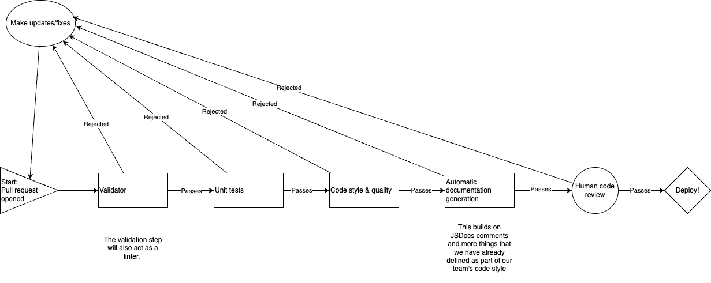

# CI/CD Pipeline – Phase 1

---

## What already works

* **Pull‑request review rule**
  Branch protection requires:

  1. All status checks defined below must succeed.
  2. A minimum of **one** approving review from a teammate.
     The rule prevents direct pushes to `main`; team members work in feature branches and open PRs.

* **Automated linting on every push and pull request** (GitHub Actions)
  Three separate workflow files live in `.github/workflows/`, one per language:

  | Language | Workflow file   | Linter            | Command                    |
  | -------- | --------------- | ----------------- | -------------------------- |
  | HTML     | `html-lint.yml` | HTMLHint v1.1.5   | `npx htmlhint "**/*.html"` |
  | CSS      | `css-lint.yml`  | Stylelint v16.4.0 | `npx stylelint "**/*.css"` |
  | JS       | `js-lint.yml`   | ESLint v9.5.0     | `npx eslint .`             |

  Each job:

  1. Checks out the repo (`actions/checkout@v4`).
  2. Installs dependencies with `npm ci`.
  3. Runs the linter command shown above.
  4. Exits with code 1 if violations are found; this blocks the PR.

* **Version‑controlled rule sets**

  ```jsonc
  // .HTMLHintrc
  {
  	"doctype-html5": true,
  	"doctype-first": true,
  	"html-lang-require": true,
  	"title-require": true,
  	"attr-lowercase": true,
  	"attr-no-duplication": true,
  	"attr-no-unnecessary-whitespace": true,
  	"attr-value-double-quotes": true,
  	"attr-whitespace": true,
  	"alt-require": true,
  	"tagname-specialchars": true,
  	"tagname-lowercase": true,
  	"id-unique": true
  }
  ```
  ```jsonc
  // .stylelintrc.json
  {
  	"extends": ["stylelint-config-standard"],
  	"rules": {
  		"block-no-empty": true,
  		"selector-class-pattern": "^[a-z][a-zA-Z0-9]+$"
    	}
  }
  ```
  ```jsonc
  // eslint.config.js
  rules: {
			"no-unused-vars": "error",
			"no-undef": "error",
			"semi": "error"
		}
  ```

---

## What is still missing / in progress

* **Unit tests** – We will add unit testing for functions we write before Phase 2. This will be ready to go by the time we are writing actual code for our project.
* **Documentation generation** – Run `npm run docs` (JSDoc) in CI and publish to the `gh-pages` branch.
* **HTML/CSS validation** – Integrate the official W3C validator action to catch spec‑level issues that lint rules might miss.

---

## How the GitHub Action works (step‑by‑step)

1. **Event trigger** – Any `push` or `pull_request` event against any branch starts the three lint jobs in parallel.
2. **Checkout** – The workflow uses a shallow clone to save time.
3. **Dependency install** – `npm ci` reads `package-lock.json` to guarantee deterministic versions.
4. **Lint execution** – Each linter scans the entire codebase; glob patterns ensure new files are included without extra edits.
5. **Result reporting** – GitHub adds a green ✓ or red × next to each job. All three must be green for the branch‑protection check to pass.
6. **Merge** – Once the PR has one approval and the check suite is green, GitHub allows a squash‑merge into `main`.

---

## File map (relevant subset)

```
/admin/cipipeline
  phase1.md
  phase1.drawio.png
  phase1.mp4

.github/workflows
  html-lint.yml
  css-lint.yml
  js-lint.yml

.HTMLHintrc
.stylelintrc.json
.eslint.config.js
```

---
## Drawio Diagram (Complete CI/CD Pipeline)


