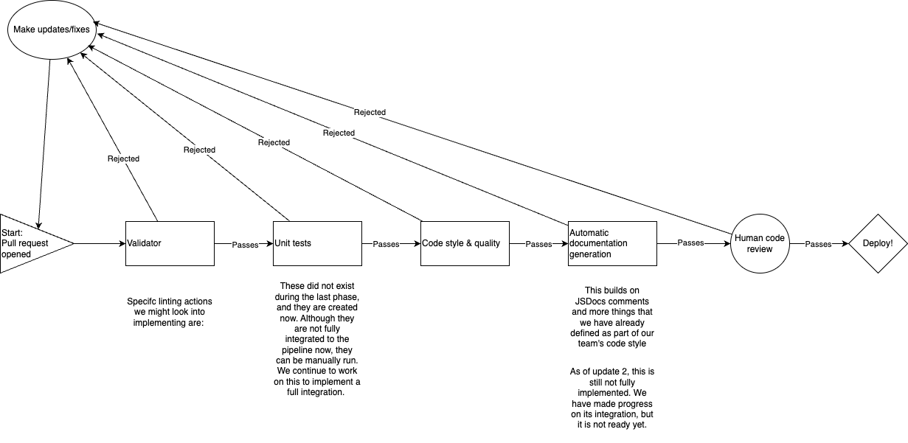

# CI/CD Pipeline – Phase 2

---

## Updates and Changes from Phase 1

### Linting Improvements and Rule Adjustments

* **HTML/CSS Linting:**  
  Updated HTMLHint and Stylelint configurations:
  - Stylelint is now fully aligned with standard defaults; all previous custom rules have been removed.
  - ESLint configuration is now primarily standard mode with three custom rules retained (as per Gautam's ADR):

  ```json
  // eslint.config.js (Updated)
  rules: {
    "no-unused-vars": "error",
    "no-undef": "error",
    "semi": "error"
  }
  ```

  ```json
  // .stylelintrc.json (Updated – standard defaults only)
  {
    "extends": ["stylelint-config-standard"]
  }
  ```

  HTMLHint configuration remains unchanged and fully operational as of Phase 1.

### Unit Testing Progress (Operational but Not Yet Integrated)

- **Unit tests** have been successfully set up and are operational on a separate branch.
- Integration into the main CI/CD pipeline is planned shortly and will ensure tests run on every push and pull request.

### Documentation Generation (Partially Functional)

- Progress has been made toward automatic JSDoc documentation generation via CI.
- JSDoc automation is currently partially functional; further debugging is required before full integration.

---

## Still missing / in progress

* **Integration of unit tests into main pipeline**  
  Unit tests currently reside on a separate branch. Integration into the pipeline is the next immediate goal.

* **Full automation of JSDoc documentation generation**  
  CI configuration to automatically generate and publish JSDocs is not yet complete.

* **HTML/CSS validation via official W3C Validator**  
  Integration of the W3C validator GitHub Action to catch additional spec-level issues.

---

## Updated GitHub Action Workflow (step‑by‑step)

1. **Event trigger** – Any `push` or `pull_request` event against any branch initiates parallel execution of the lint jobs.
2. **Checkout** – A shallow clone (`actions/checkout@v4`) continues to ensure efficiency.
3. **Dependency install** – Dependencies installed via `npm ci` using deterministic versions from `package-lock.json`.
4. **Lint execution** – ESLint (with standard mode plus three custom rules), HTMLHint, and Stylelint (fully standard) check codebases via glob patterns.
5. **Result reporting** – GitHub indicates linting results clearly (green ✓ or red ×). Passing all three linters remains mandatory for merging.
6. **Merge** – PRs merge after passing linting checks and receiving at least one approval.

---

## Drawio Diagram (Complete CI/CD Pipeline – Updated for Phase 2)

Updated diagram includes new blocks representing:

- Unit Testing (currently operational, pending integration)
- Documentation generation via JSDoc (partially functional)


