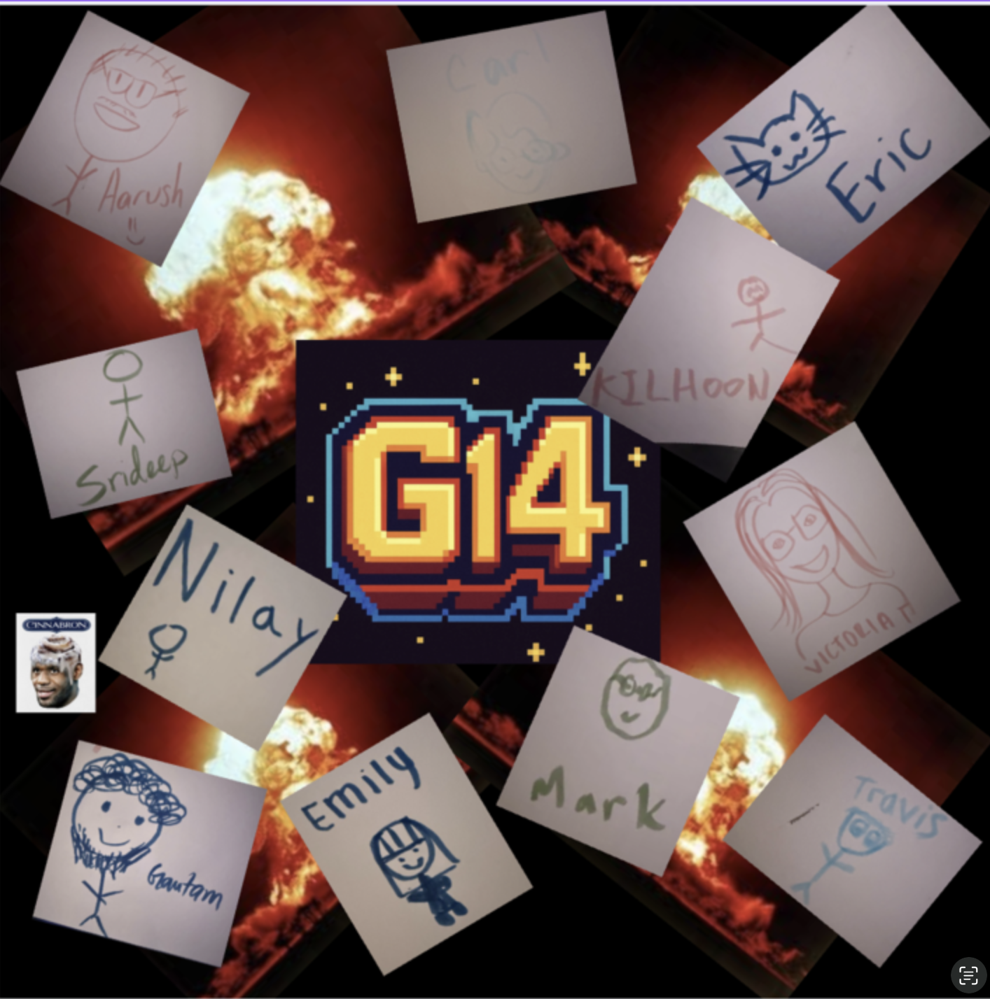

# Team Name

## Team Values
    - [ ] No micromanaging, but a respect for everyone else on the team and responsibility for our share of the work 
    - [ ] Get things done early, ideally one day before
    - [ ] Read things immediately 
    - [ ] React to messages on slack to show that they've been read 
    - [ ] Meetings: 
            - Work meetings are better in person, updates can be online 
            - Meet once a week for now, consider increasing once workload increases 
    - [ ] People with web dev/internship experience will help explain things once coding begins 
    - [ ] It's good to ask questions! There are no bad questions. 

## Our Team
- Gautam Mohandas [(GitHub)](https://github.com/GMohandas13/CSE110)

  - Hi, I'm Gautam! I'm a third-year transfer student majoring in Computer Science. I enjoy watching basketball and building cars.
- Carl Casares [GitHub link](https://cacasares.github.io/CSE110PgsProj/)

  Hello! I'm Carl, I'm a fourth-year math-c.s. major. I love rock climbing and drawing!
- Aarush Mehrotra is a third-year double major in Math-CS and Economics. I am currently an HPC Intern at the San Diego Supercomputer Center and a member of the UCSD Supercomputer and Triathlon teams. [View my GitHub here](github.com/iAarush)
- Srideep Dornala [GitHub link](https://srideep9.github.io/CSE-110-Lab-1/)
  - 2nd Year
  - Computer Science Major
- Eric Wang [(GitHub)](https://j5995.github.io/Github-Pages/)

  Hi, I'm Eric. I'm a third-year computer engineering major at UCSD. I enjoy playing basketball and petting cats in my free time.
- Travis Huang [(GitHub)](https://github.com/travishuang24)

  I am a third-year transfer student majoring in Computer Science
- Mark Escarrilla [(GitHub)](https://yscmark.github.io/about-me/)
  - 3rd Year
  - Math-CS Major
- Emily Cai [(GitHub)](https://emilyycaii.github.io/CSE-110-Lab-1/)

  I am a third year, first year transfer, CS major. I like watching movies on my free time.
- Victoria (Vicky) Tran [(GitHub)](https://victoriatr6n.github.io/cse110lab1/)

  Hi! I'm Vicky, I'm a second-year computer science major. Some of my hobbies include playing tennis, drawing/painting, and listening to music. 

[Team Intro Video](videos/placeholder.txt)
